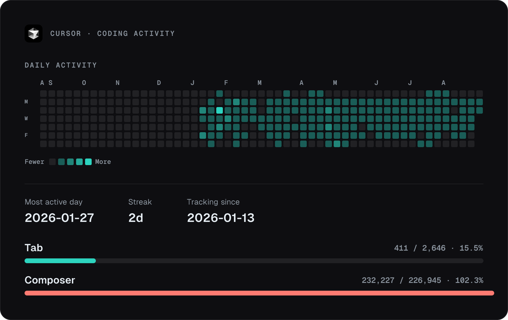

<div align="center">
  
</div>

<div align="center">

  [](https://git.io/typing-svg)

  **SDE 2 (Backend)** · NestJS, TypeScript, PostgreSQL · Bengaluru, India

  [](https://www.linkedin.com/in/shashank-basutkar-3bb523206/)
  [](https://shashanksb17.github.io)
  [](https://drive.google.com/file/d/1Z9c17pRV4UHUv0vQ6GyRpMO8Diu2usRn/view?usp=sharing)
  [](mailto:sbasutkar999@gmail.com)
  [](https://cursor.com)

</div>

---

## About

I design and ship **backend systems for fintech** — auth, payments, partner flows, and high-traffic APIs — with NestJS, TypeScript, and PostgreSQL.

```javascript
const shashank = {
  role: "SDE 2 — Backend",
  location: "Bengaluru, India",
  languages: ["TypeScript", "JavaScript", "SQL", "Python"],
  askMeAbout: [
    "NestJS",
    "REST APIs",
    "RBAC / permissions",
    "PostgreSQL",
    "Redis caching",
    "payment integrations",
    "system design"
  ],
  technologies: {
    backend: ["Node.js", "NestJS", "Express"],
    databases: ["PostgreSQL", "Redis", "MongoDB", "Sequelize"],
    auth: ["JWT", "RBAC", "CASL"],
    cloud: ["AWS", "Docker", "Jenkins", "GitHub Actions"],
    also: ["Django", "React"]
  },
  editor: "Cursor",
  currentFocus: "Scalable APIs, data integrity, and clean architecture",
};
```

**What I work on**

- High-traffic APIs with Redis caching
- Subscription and partner programs
- Vendor-to-in-house backend migrations
- RBAC and API permissions
- Payments, SMS, WhatsApp, and Docs integrations

---

## Stack

<p align="center">
  <a href="https://skillicons.dev">
    
  </a>
</p>

| Area | Tools |
| --- | --- |
| **Languages** | TypeScript · JavaScript · SQL · Python |
| **Backend** | NestJS · Node.js · Express · REST · WebSockets |
| **Data** | PostgreSQL · Sequelize · Redis · MongoDB |
| **Auth** | JWT · RBAC · CASL |
| **Cloud & delivery** | AWS · Docker · Jenkins · GitHub Actions |
| **Editor** | Cursor |
| **Also used** | Django · React · HTML/CSS |

---

<<<<<<< HEAD
## Experience

| Company | Role | Focus |
| --- | --- | --- |
| **Creddinv** | SDE 2 — Backend | Fintech APIs, payments, RBAC, Redis, partner programs |
| **K12 Techno Services** | SDE 1 — Backend | Notification microservice, CareerBox HR platform, query optimization |

---

## Selected work

**Production** *(most of this is private)*

| What | What I built |
| --- | --- |
| Fintech backend — NestJS, PostgreSQL, Redis | Vendor migration, RBAC, payments and partner APIs |
| Subscription & partner programs | Investor onboarding; Payments / SMS / WhatsApp / Docs |
| CareerBox + notifications (K12) | HR platform backend; push / in-app / email notifications |

**Public**

| Project | What it is |
| --- | --- |
| [Video Chat (Airmeet)](https://github.com/shashanksb17/Video-Chat_application) | Real-time video rooms |
| [CodeSweeper](https://github.com/shashanksb17/CodeSweeper) | AI-assisted convert / debug / quality checks |
| [Air Ticket Booking API](https://github.com/shashanksb17/Air-Ticket-Booking-backend) | Node + Express + JWT booking backend |
| [Chunked file upload](https://github.com/shashanksb17/Chunked-file-upload-ctruh) | Parallel chunked uploads |

---

## GitHub

<p align="center">
  
  
</p>

<p align="center">
  
</p>

<p align="center">
  
</p>

<p align="center">
  
  
  
</p>

<p align="center">
  
</p>

<p align="center"><i>Top languages reflect public repos only — not everything I work on day to day.</i></p>

---

## Cursor

Daily editor for NestJS / TypeScript backend work.

<!-- cursor-stats:start -->
<p align="center">
  
</p>
<!-- cursor-stats:end -->

---

## Reach me

Open to backend roles, system-design discussions, and NestJS / Node work.

<p align="center">
  <a href="mailto:sbasutkar999@gmail.com"></a>
  <a href="https://www.linkedin.com/in/shashank-basutkar-3bb523206/"></a>
  <a href="https://twitter.com/shashankb98"></a>
</p>

<div align="center">
  
</div>

